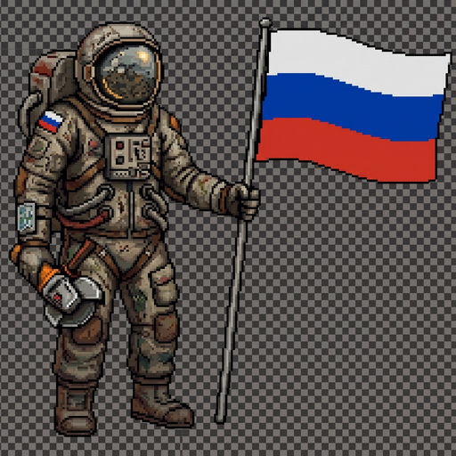

# OstraI18n — Полная русификация Ostranauts (v2.0)

<p align="center">
  
</p>

<p align="center">
  <b>Комплексная модификация полной русификации и мультиязычный движок для космического симулятора <a href="https://store.steampowered.com/app/1020210/Ostranauts/">Ostranauts</a></b><br>
  Разработано <b>CFLabs (CoreForgeLabs)</b>
</p>

<p align="center">
  <a href="https://boosty.to/coreforgelabs"></a>
  <a href="https://github.com/CoreForgeLabs/Ostranauts_i18n/releases"></a>
  <a href="LICENSE"></a>
</p>

---

> ### 📢 Важно: где брать актуальную версию
> Чтобы избежать багов и путаницы со старыми версиями, все самые свежие сборки, голосования за обновления и ранний доступ публикуются на **Boosty**.  
> 👉 **Скачать актуальную сборку: [boosty.to/coreforgelabs](https://boosty.to/coreforgelabs)**  
> *(Исходные файлы проекта, ядро локализации и инструкции открыты и лежат в этом репозитории).*

---

## ❤️ Support / Поддержка

**Made with love by [@CoreForgeLabs](https://t.me/CoreForgeLabs)**  
*Telegram · Discord*

> *«Это одна из моих любимых игр, и я искренне хочу развивать наше небольшое сообщество. Ваша поддержка — это не просто финансовая помощь. Это огромная мотивация продолжать работу и уверенность, что проект кому-то действительно нужен и важен.»*

| Способ | Реквизиты / Ссылка |
| :--- | :--- |
| **🟠 Boosty** | **[boosty.to/coreforgelabs](https://boosty.to/coreforgelabs)** |
| **💳 Т-Банк** | `2200 7013 8955 0366` |
| **🪙 BTC** | `bc1qjzw4nz6y0dl3pvy8v46j70yywsh4l78sg0eq3x` |
| **💎 ETH / USDT / USDC (ERC-20)** | `0xc9B7c16ef301E6277BbEB28C9AfCEC7c107d244E` |

🛠️ **Помимо разработки модов / Besides modding:**  
🤖 Telegram/Discord боты • ⚙️ Автоматизация • 🔗 Интеграции систем • 🌍 Локализация игр  
*Пишите — отвечу всем! / Feel free to reach out! :)*

---

## 🎖️ Бортовой манифест экипажа (Boosty)

*Сердечная благодарность всем, благодаря кому этот проект существует и развивается:*

- 👑 **ШЕЙХ:**
  `Сергей Коршунов`

- 🎖️ **АДМИРАЛЫ:**
  `Миша Аверин`, `Towland`

- 🚀 **КАПИТАНЫ:**
  `Gundyar`, `Сергей Примаков`, `Zurics Game`

- ⚓ **ЮНГИ:**
  `GreyViS`, `Pavel Bezik`, `LunarGoat`, `jard`, `languin`, `Анна Плагиатор`

---

## 🌟 Что нового в версии v2.0 (OstraI18n Engine)

- 🚀 **100% перевод интерфейса и механик:**
  - Главное меню, создание персонажа, истории жизни и дерево навыков.
  - Бортовые экраны MFD (многофункциональные дисплеи), терминалы и радары.
  - Система радиосвязи (Comms) и переговоры со станциями и кораблями.
  - Панель управления термоядерным реактором (Fusion Reactor IC).
  - Биржа кораблей (Ship Broker), магазины, контракты и инвентарь.
  - Всплывающие подсказки (MegaTooltip) и диалоговые окна.

- 🧠 **Грамматический движок склонений:**
  - Динамическое спряжение глаголов по лицам (1-е, 2-е и 3-е лицо: *«Ты собираешься...»* / *«Доркас Гулд собирается...»*).
  - Падежные окончания для сгенерированных имён NPC, предметов и помещений.

- 🔤 **Модульные кириллические SDF-шрифты:**
  - Чёткий, масштабируемый кириллический шрифт `Jura` высокого разрешения (TextMeshPro Signed Distance Field), исключающий размытие на любых разрешениях.

- 🌐 **Мгновенное переключение языка на лету:**
  - Интерактивный космонавт в Главном меню позволяет переключаться между русским и английским языками в один клик без перезапуска игры.

- 📜 **Интерактивное окно «Экипаж» в Главном меню:**
  - Просмотр списка поддержавших проект прямо из игры.

---

## 📦 Установка для игроков (В один шаг)

1. Скачайте архив **`OstraI18n_v2.0.zip`** со страницы **[Releases](https://github.com/CoreForgeLabs/Ostranauts_i18n/releases)** или на **[Boosty](https://boosty.to/coreforgelabs)**.
2. Распакуйте **всё содержимое архива** (папку `BepInEx`, файлы `winhttp.dll` и `doorstop_config.ini`) в корневую папку игры *Ostranauts*:
   ```
   C:\Program Files (x86)\Steam\steamapps\common\Ostranauts\
   ```
   *(так, чтобы файл `winhttp.dll` оказался в одной папке с `Ostranauts.exe`)*
3. Запустите игру. **Готово!**

---

## 🛠️ Сборка из исходников

```
├── core/                  # Исходный код ядра OstraI18n.Core (C# .NET Standard 2.1)
├── plugin/                # Исходный код плагина OstraI18n для BepInEx 6 (Unity Mono)
├── catalog/               # Каталоги префабов и утверждённых литералов
├── langs/                 # Языковые пакеты (ru, en: грамматика, шрифты, текстуры, json-данные)
├── workshop/              # Файлы для Мастерской Steam (обложка preview.png, mod_info.json)
├── Релиз/                 # Папка готового дистрибутива
├── build_release.py       # Скрипт автоматической компиляции и сборки релиза
└── build_release.bat      # Батник для сборки релиза в 1 клик
```

### Команды сборки:
```bash
# Сборка проекта
dotnet build core/OstraI18n.Core/OstraI18n.Core.csproj -c Release
dotnet build plugin/OstraI18n/OstraI18n.csproj -c Release

# Сборка дистрибутива в папку "Релиз"
python build_release.py
```

---

© 2026 **CoreForgeLabs**
